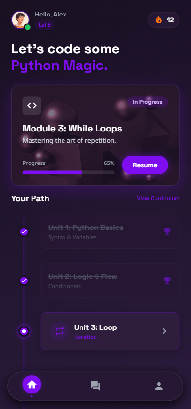
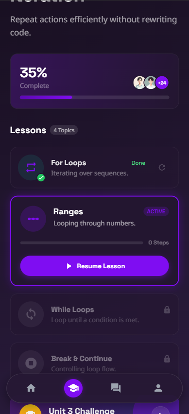
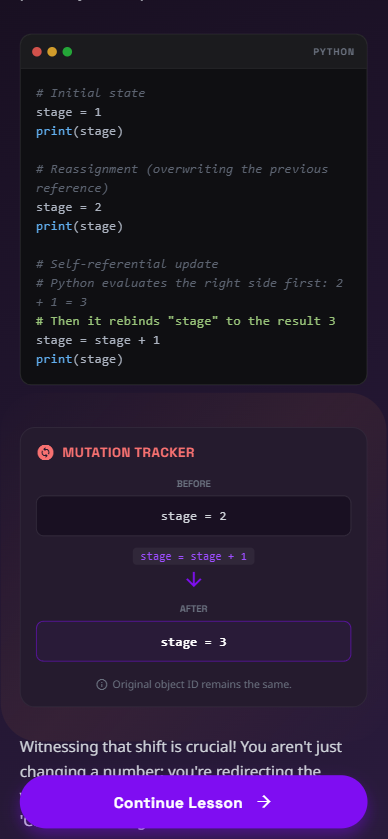
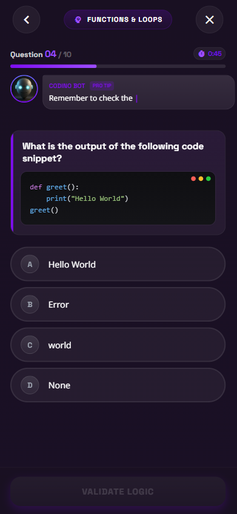
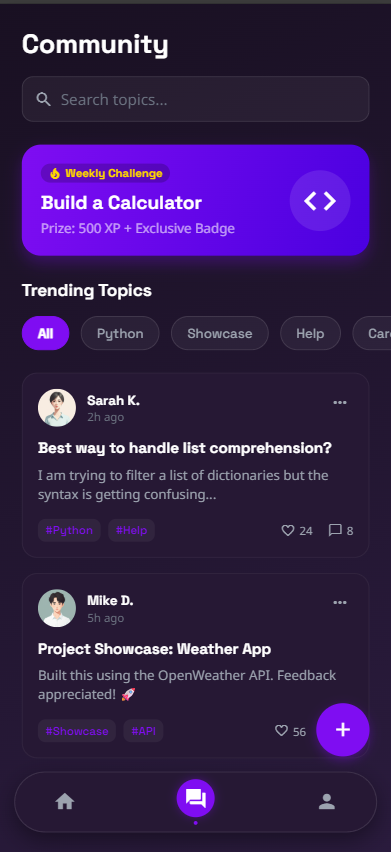
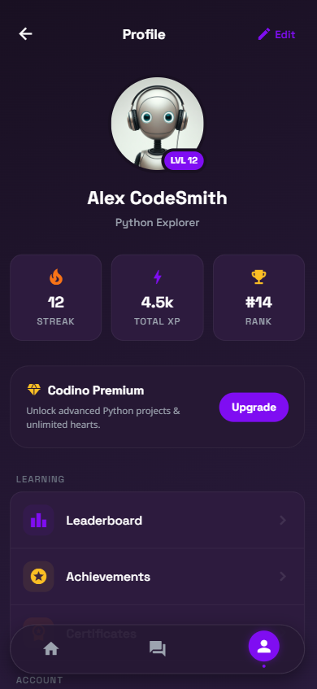

  

---

  <b>The Elite Pedagogical Engine for Python Mastery</b> 
  Codino is an enterprise-grade learning ecosystem engineered to transform beginners into senior-level software architects. 

---

### Conceptual Architecture
Codino departs from the standard static learning paradigm. We have implemented a high-fidelity "Triple-Thread" protocol that ensures absolute conceptual retention. By combining theoretical depth with real-time state visualization, we eliminate the cognitive gaps present in traditional education.

  

### The Masterclass Protocol
Our curriculum is built for those who demand technical rigor. Every lesson is meticulously crafted to explore the inner machinery of the Python language—investigating memory allocation, bytecode execution, and complex algorithmic flow. 

  

### Interactive Visualization Engine
The heart of Codino is its proprietary visualization library. This engine provides a literal "window into the machine," allowing students to observe code behavior as it happens.

| Component | Technical Utility |
| :--- | :--- |
| **Execution Timelines** | Granular step-through of logic flows with state tracking. |
| **Mutation Trackers** | Instant visualization of memory re-assignment. |
| **Syntax Blueprints** | Deconstruction of complex code structures into manageable models. |
| **Logic Simulators** | Real-time evaluation of branching decision paths. |

  

### Knowledge Exchange Layer
Synthesizing information is a collaborative process. Codino includes a high-performance community hub designed for technical discourse and peer-to-peer knowledge transfer.

  

Students can engage in deep-dive threads to resolve complex engineering queries and share breakthroughs in real-time.

  

### Profile
The profile interface serves as the central command center for student progression. It provides a comprehensive overview of performance metrics and milestones achieved during the mastery process.

*   **Progression Tracking**: Real-time monitoring of XP accumulation, current rank, and daily learning streaks.
*   **Competitive Analysis**: Integrated leaderboard functionality to track standing against the elite student body.
*   **Milestone Recognition**: Management of earned achievements and unlocked technical badges.
*   **Professional Certification**: Automated issuance of masterclass certificates upon successful curriculum completion.

  

---

### Project Status
Codino is currently in an **Intensive Development Phase**. Our engineering team is focused on expanding the content depth and refining the visualization engine's performance across all platform environments.

### Future Roadmap
*   Official deployment to the Google Play Store and Apple App Store.
*   Continuous iteration and refinement of interactive visualization models.
*   Expansion of the premium content library with advanced technical modules.
*   Optimization of the community engine for enhanced knowledge sharing.

---

  Codino: Engineering the Future of Knowledge.

